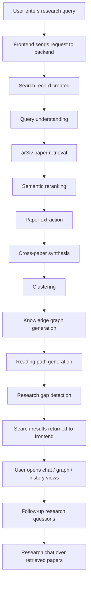

# Research Copilot

Research Copilot is an AI-powered scientific literature exploration platform built to help users search, compare, synthesize, and discuss research papers more efficiently. The system combines a FastAPI backend, a React frontend, PostgreSQL for persistence, Redis for background task support, and local or remote AI services for retrieval, reranking, synthesis, and conversational research assistance.

The main goal of the platform is to turn a broad research query into an organized workflow:

1. Understand the query.
2. Retrieve relevant papers from arXiv.
3. Rerank results by semantic similarity.
4. Extract useful research signals from papers.
5. Build summaries, clusters, knowledge graphs, and reading paths.
6. Let the user continue the discussion through a research chat experience.

## Platform Overview

Research Copilot is designed for iterative literature exploration rather than simple keyword search. It helps users move from "I have a topic" to "I have a structured understanding of the space" by chaining several AI-assisted stages together.

At a high level, the platform supports:

- Query understanding and expansion
- arXiv paper retrieval
- Semantic reranking of paper results
- Paper extraction and synthesis
- Clustering and topic grouping
- Knowledge graph generation
- Reading path recommendations
- Research gap detection
- Chat over retrieved papers with citations-ready context
- Authentication, user sessions, and analytics

## Key Capabilities

### Research Search

Users submit a research query and the backend starts an asynchronous research pipeline. The request returns a `search_id`, and the frontend can poll for updates until the pipeline finishes.

### Paper Discovery

The backend retrieves papers from arXiv and deduplicates results before passing them through later stages.

### Semantic Ranking

Embeddings are used to rank papers by relevance to the user query rather than relying only on raw keyword matching.

### Research Synthesis

The pipeline extracts and organizes information such as:

- problem statement
- motivation
- method
- datasets
- architecture
- training strategy
- evaluation
- results
- limitations
- future work
- contribution

### Knowledge Graphs

The system can generate a graph view of relationships between papers, topics, and ideas.

### Research Chat

Users can ask follow-up questions grounded in the retrieved papers and get contextual answers from the research chat agent.

### Analytics

The backend exposes analytics about platform usage, processed papers, explored topics, generated research maps, and user activity.

## How It Works

The platform follows a staged pipeline:

1. A user submits a topic or question.
2. The backend stores the search request.
3. The pipeline expands the query into search-friendly terms.
4. arXiv results are fetched.
5. Embedding-based reranking prioritizes the strongest matches.
6. Paper details are extracted and normalized.
7. The system builds synthesis outputs, topic clusters, graphs, and reading paths.
8. The search state is updated and exposed to the frontend.
9. The user can open the result set and continue with research chat.

## Flowchart



## Media

This section is intended for product visuals, screenshots, and demo assets. If you want to keep the README polished, add images such as:

- Home page or dashboard screenshot
- Search results screenshot
- Knowledge graph screenshot
- Research chat screenshot
- Reading path screenshot

Suggested usage:

```md


```

If you add real media files, keep them lightweight and place them in a dedicated folder such as `docs/media/`.

## Backend API Highlights

The backend exposes the following major API groups:

- `POST /api/v1/auth/register`
- `POST /api/v1/auth/login`
- `POST /api/v1/auth/refresh`
- `GET /api/v1/auth/me`
- `POST /api/v1/auth/logout`
- `GET /api/v1/papers`
- `GET /api/v1/papers/{paper_id}`
- `GET /api/v1/papers/arxiv/{arxiv_id}`
- `POST /api/v1/search/`
- `GET /api/v1/search/{search_id}`
- `GET /api/v1/search/history`
- `GET /api/v1/graphs/{search_id}`
- `POST /api/v1/chat/`
- `GET /api/v1/analytics/`
- `GET /health`

## Runtime Architecture

The current backend is designed to run with:

- FastAPI for HTTP APIs
- PostgreSQL for persistent app data
- Redis for supporting background workflows
- Ollama running on your machine for local model inference

For the Docker setup in this repository, the backend container points to Ollama on the host machine via:

```env
OLLAMA_BASE_URL=http://host.docker.internal:11434
```

That means:

- Docker runs the backend, PostgreSQL, and Redis
- Ollama runs separately on your computer
- The backend calls Ollama over the host network bridge

## Environment Variables

The backend reads its configuration from `Backend/.env`.

Common settings include:

- `PROJECT_NAME`
- `DEBUG`
- `SECRET_KEY`
- `ACCESS_TOKEN_EXPIRE_MINUTES`
- `REFRESH_TOKEN_EXPIRE_DAYS`
- `POSTGRES_SERVER`
- `POSTGRES_USER`
- `POSTGRES_PASSWORD`
- `POSTGRES_DB`
- `POSTGRES_PORT`
- `BACKEND_CORS_ORIGINS`
- `REDIS_HOST`
- `REDIS_PORT`
- `REDIS_PASSWORD`
- `CHROMA_HOST`
- `CHROMA_PORT`
- `OLLAMA_BASE_URL`
- `OLLAMA_MODEL`
- `ARXIV_API_URL`
- `ARXIV_MAX_RESULTS`
- `EMBEDDING_MODEL_NAME`
- `HDBSCAN_MIN_CLUSTER_SIZE`
- `HDBSCAN_MIN_SAMPLES`

## Local Development

### Prerequisites

- Python 3.11 or newer
- Node.js 20 or newer
- PostgreSQL
- Redis
- Ollama running locally if you want full AI functionality

### Backend

From the `Backend` directory:

```bash
python -m venv venv
venv\Scripts\activate
pip install -r requirements.txt
uvicorn app.main:app --reload --port 8000
```

### Frontend

If you want to run the frontend separately, start it from the frontend app directory with the Vite workflow used by the repository.

## Docker Usage

This repository supports a backend-only Docker workflow.

### Run the backend stack

```bash
docker compose up --build
```

This starts:

- PostgreSQL
- Redis
- Backend API

It does not start:

- the frontend container
- the Ollama container

### Stop the stack

```bash
docker compose down
```

## Ollama Setup

Because the backend is configured to use Ollama on the host machine, make sure Ollama is running before you start the research pipeline.

Example:

```bash
ollama serve
```

Then ensure the model configured in `Backend/.env` is available locally, for example:

```bash
ollama pull qwen3:14b
```

If you use a different model, update `OLLAMA_MODEL` accordingly.

## Notes

- The search endpoint is asynchronous and returns a `search_id`.
- The frontend can poll the result endpoint until the job is completed.
- The platform is intended for research assistance, not as a substitute for careful reading of primary sources.
- For production, you would typically add migrations, stronger background job handling, and more explicit error reporting.

## Troubleshooting

### Backend starts but search fails

- Check that PostgreSQL is running.
- Check that Redis is running if your workflow depends on it.
- Check that Ollama is running on the host machine.
- Confirm `OLLAMA_BASE_URL` points to the correct address.

### Docker backend cannot reach Ollama

- On Windows and macOS, `host.docker.internal` is usually the right host alias.
- On Linux, you may need to use the host IP or add the appropriate Docker host-gateway mapping.

### First request returns 500

- Make sure the database is reachable.
- Make sure the backend `.env` values are correct.
- Review backend logs for the actual exception trace.

## License

Add your preferred license here if the project will be distributed publicly.
