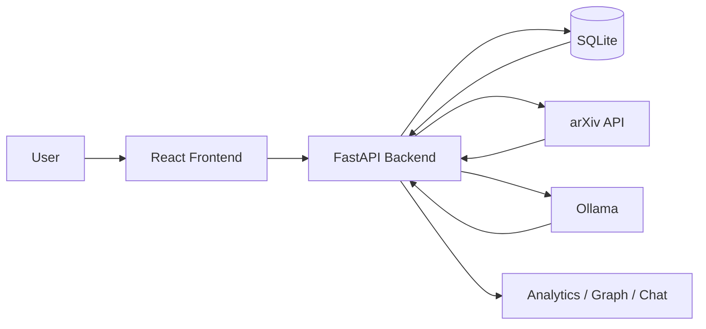
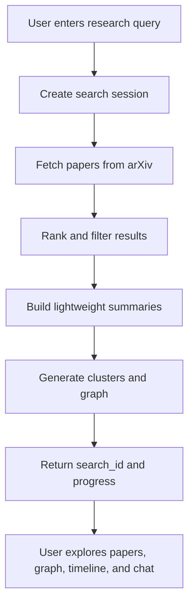

# Research Copilot

Research Copilot is an AI-powered scientific literature platform that helps users discover, analyze, and discuss research papers from a single query. It combines a React frontend, a FastAPI backend, SQLite persistence, and Ollama-driven local model inference to support end-to-end literature exploration: retrieval, ranking, synthesis, graphing, and research chat.

## What It Does

Research Copilot turns a broad research question into a structured exploration workflow:

- Retrieves relevant papers from arXiv
- Ranks results by semantic relevance
- Extracts paper-level signals and summaries
- Generates knowledge graphs and reading paths
- Identifies likely research gaps
- Enables follow-up chat grounded in retrieved papers

The goal is to reduce the time between a research question and a usable understanding of the literature.

## Core Capabilities

- Query understanding and search expansion
- arXiv paper retrieval and deduplication
- Fast relevance ranking
- Paper summarization and structured extraction
- Landscape synthesis and topic grouping
- Knowledge graph generation
- Reading path recommendations
- Research gap detection
- Context-grounded chat over retrieved papers
- User-facing analytics and activity history

## System Architecture



### Components

- Frontend: Provides the UI for search, dashboard, graph, reading map, timeline, and chat
- Backend: Exposes REST APIs and orchestrates the research pipeline
- SQLite: Stores users, papers, and search history locally
- arXiv: Supplies paper metadata and abstracts
- Ollama: Powers query understanding, synthesis, and chat responses

## Workflow



### Search Flow

1. The user submits a topic or question.
2. The backend creates a search session and begins processing.
3. arXiv results are fetched and ranked.
4. The system builds summaries, clusters, and navigation views.
5. The frontend polls for completion and renders the results.
6. The user can continue with graph exploration or research chat.

## Tech Stack

- Frontend: React, Vite, Framer Motion, Zustand
- Backend: FastAPI, SQLAlchemy, Pydantic
- Database: SQLite
- AI runtime: Ollama
- External data: arXiv API
- Charts / graphing: Recharts, React Flow, NetworkX

## Local Setup

### Prerequisites

- Python 3.11+
- Node.js 20+
- Ollama running locally

### Backend

```powershell
cd E:\Research Copilot\Backend
python -m venv venv
venv\Scripts\activate
pip install -r requirements.txt
uvicorn app.main:app --reload --port 8000
```

### Frontend

```powershell
cd E:\Research Copilot\Frontend
npm install
npm run dev
```

## Configuration

Backend settings are read from `Backend/.env`.

Key values include:

- `SQLALCHEMY_DATABASE_URI`
- `BACKEND_CORS_ORIGINS`
- `OLLAMA_BASE_URL`
- `OLLAMA_MODEL`
- `ARXIV_API_URL`
- `ARXIV_MAX_RESULTS`
- `EMBEDDING_MODEL_NAME`

For local development, the backend uses SQLite and expects Ollama to be reachable at the configured base URL.

## Docker

Docker is optional. If you prefer containerized backend execution, the repository includes a backend-focused compose file. The backend still uses the local Ollama runtime for model calls.

```bash
docker compose up --build
```

## API Highlights

- `POST /api/v1/auth/register`
- `POST /api/v1/auth/login`
- `GET /api/v1/auth/me`
- `GET /api/v1/papers`
- `GET /api/v1/papers/{paper_id}`
- `POST /api/v1/search/`
- `GET /api/v1/search/{search_id}`
- `GET /api/v1/search/history`
- `GET /api/v1/graphs/{search_id}`
- `POST /api/v1/chat/`
- `GET /api/v1/analytics/`
- `GET /health`

## Product Notes

- Search runs asynchronously and returns a `search_id`
- The frontend can poll for progress and completion
- Chat is grounded in the papers retrieved for the current search session
- The system is designed for interactive literature review, not one-off keyword lookup

## Troubleshooting

- If search is slow, confirm Ollama is running and reachable
- If the backend cannot start, verify the SQLite path is writable
- If paper retrieval is empty, check internet access to arXiv
- If chat is slow, reduce the model size or lower the context length in the backend config

## License

Add the project license here if you plan to publish or distribute the repository.
